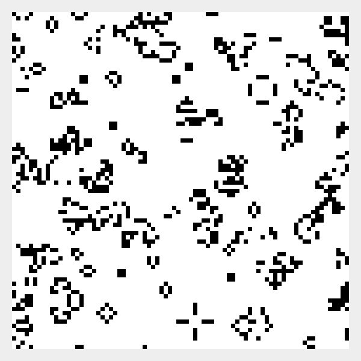
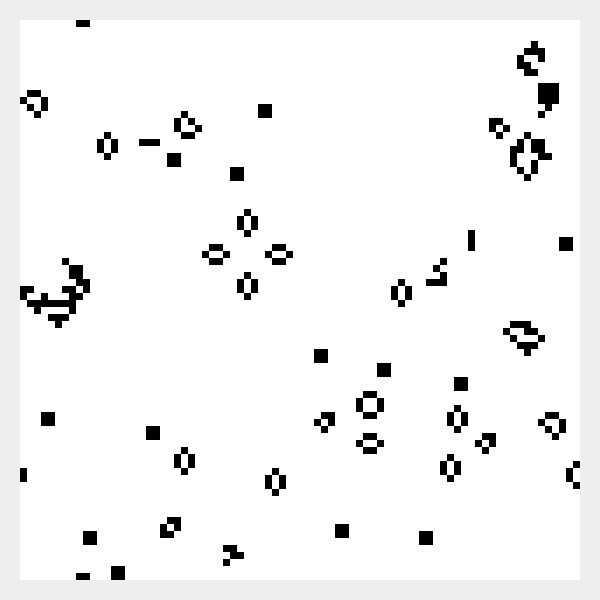

# Conway's Game Of Life

[The Game of Life](https://en.wikipedia.org/wiki/Conway%27s_Game_of_Life) is a cellular automata invented by british
mathematician John Horton Conway. The evolution of the automata is determined only by the current state and with
exception of the initial state, no input is needed. 

Each cell of the cellular automata can be either live or dead, and the cell interacts with eight of its neighbors (
horizontally, vertically, or diagonally adjacent). At each iteration one of the following transitions can occur: 

1) Any live cell with fewer than two live neighbours dies, as if by underpopulation.
2) Any live cell with two or three live neighbours lives on to the next generation.
3) Any live cell with more than three live neighbours dies, as if by overpopulation.
4) Any dead cell with exactly three live neighbours becomes a live cell, as if by reproduction.

These rules can be reformulated in the following way:

1) Any live cell with two or three live neighbours survives.
2) Any dead cell with three live neighbours becomes a live cell.
3) All other live cells die in the next generation. Similarly, all other dead cells stay dead.

These rules are applied simultaneously to every cell, live or dead; births and deaths occur simultaneously. 

Despite the fact that the rules that govern the evolution of this cellular automata are very simple, they can lead to an
interesting emergent behavior. Several stable patterns can be observed and the most common types can be classified into
three groups: still lifes (they don't change between generations), oscillators (they return to their initial state after
a finite number of iterations), and spaceships (they propel themselves across the grid). However, other patterns can be 
quiet chaotic.

The Game of Life is undecidable (this is the corollary of the [halting problem](https://en.wikipedia.org/wiki/Halting_problem)), 
which means that there is no algorithm that would be able to determine if the program would run forever or stop based on
a given initial input.

In this repo is an implementation of Conway's Game of Life in Java. It starts from a randomly generated initial state 
and the program runs until it is closed.

